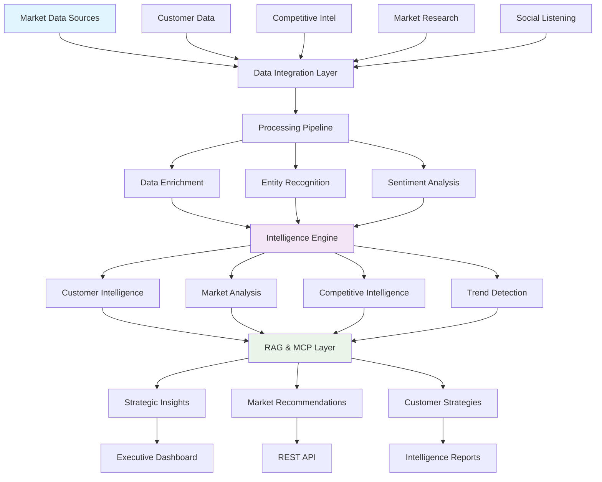
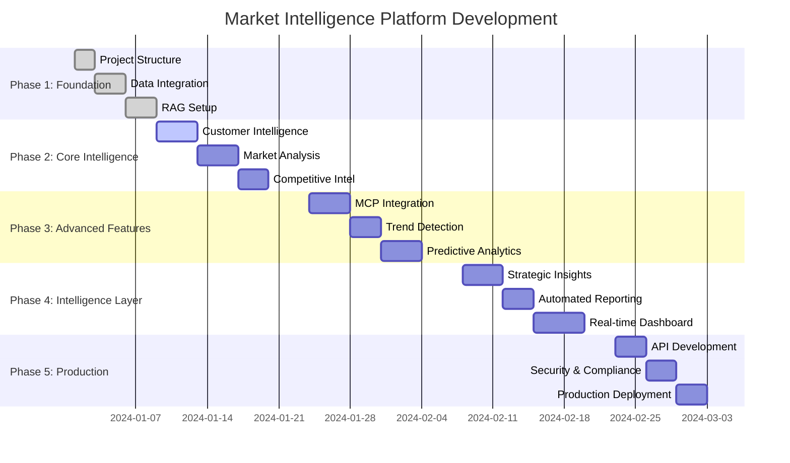

# 🧠 Market Customer Intelligence Platform - Project Manifest

**Advanced Customer Intelligence & Market Analysis Platform with AI-Driven Insights**

## 🎯 Project Vision

Revolutionary market intelligence platform that combines customer analytics, competitive intelligence, and market research to provide comprehensive insights for strategic decision-making. Leverages RAG (Retrieval-Augmented Generation) and MCP (Model Context Protocol) for real-time intelligence gathering.

## 🏗️ Architecture Overview

### **Market Intelligence System Design**



## 🚀 Technology Stack

### **Core Intelligence & Analytics**
- **🐍 Python 3.8+** - Core platform development
- **🐼 Pandas** - Market data manipulation
- **🔢 NumPy** - Numerical analysis
- **🤖 LangChain** - RAG implementation
- **📊 Vector Databases** - Knowledge retrieval
- **🧠 Transformers** - NLP and entity recognition
- **📉 Matplotlib/Seaborn/Plotly** - Intelligence visualization

### **Market Intelligence APIs**
- **🏪 CRM Integrations** - Customer data
- **📊 Social Media APIs** - Social listening
- **📰 News APIs** - Market sentiment
- **💼 Business Intelligence** - Competitive data
- **📈 Market Research APIs** - Industry insights

### **RAG & Knowledge Management**
- **🔍 Vector Stores** - ChromaDB, Pinecone
- **📚 Document Processing** - Unstructured data handling
- **🤖 MCP Integration** - Model Context Protocol
- **💬 Conversational AI** - Intelligence querying
- **📊 Knowledge Graphs** - Relationship mapping

## 📋 Implementation Phases



## 🎯 Core Intelligence Components

### **1. Customer Intelligence Engine**
**Purpose**: Deep customer insights and behavioral analysis

**Capabilities**:
- Customer journey mapping
- Behavioral segmentation
- Lifetime value analysis
- Churn prediction
- Personalization recommendations

### **2. Market Analysis Module**
**Purpose**: Comprehensive market landscape understanding

**Capabilities**:
- Market size estimation
- Growth trend analysis
- Opportunity identification
- Risk assessment
- Market entry strategies

### **3. Competitive Intelligence**
**Purpose**: Real-time competitive landscape monitoring

**Capabilities**:
- Competitor tracking
- Price monitoring
- Product comparison
- Market share analysis
- Strategic moves detection

### **4. RAG-Powered Insights**
**Purpose**: Intelligent querying and knowledge retrieval

**Capabilities**:
- Natural language intelligence queries
- Document-based question answering
- Cross-reference analysis
- Automated insight generation
- Contextual recommendations

## 🗂️ Project Structure

```
portfolio-market-customer-intelligence/
├── docs/project_manifest.md    # 📋 This project blueprint
├── quick_start.py              # 🚀 5-minute intelligence demo
├── requirements.txt            # 📦 Core dependencies
├── pyproject.toml             # 📋 Package configuration
│
├── src/                       # 🔧 Core intelligence logic
│   ├── mcp/                   # Model Context Protocol
│   ├── rag/                   # RAG implementation
│   ├── intelligence/          # Core intelligence modules
│   ├── analytics/             # Advanced analytics
│   └── insights/              # Insight generation
│
├── data/                      # 📊 Market data
│   ├── samples/               # Demo datasets
│   ├── schemas/               # Data validation
│   ├── knowledge_base/        # RAG knowledge store
│   └── synthetic/             # Generated test data
│
├── infrastructure/            # ☁️ Deployment
│   ├── vector_store/          # Vector database setup
│   └── monitoring/            # Performance monitoring
│
└── tests/                     # 🧪 Testing suite
```

## 🎯 Success Criteria

### **Intelligence Quality**
- **90%+ accuracy** in market predictions
- **Real-time insights** with sub-minute latency
- **Comprehensive coverage** of market segments
- **Actionable recommendations** for strategy

### **Business Impact**
- **Strategic decision support** for market entry
- **Competitive advantage** through intelligence
- **Customer insight** driving revenue growth
- **Risk mitigation** through market analysis

---

**This manifest serves as the blueprint for building a comprehensive market intelligence platform that combines customer analytics, competitive intelligence, and AI-powered insights for strategic advantage.**